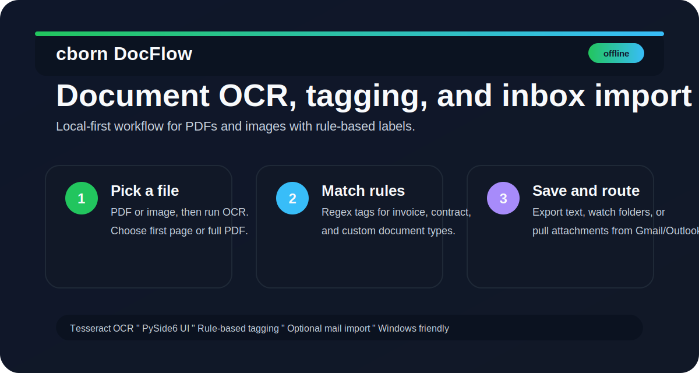

# cborn DocFlow




## About

cborn DocFlow is a polished, local-first desktop app for OCR processing of PDFs and images, rule-based tagging, and optional Gmail/Outlook attachment import. It is designed for fast document intake workflows where privacy, control, and repeatable classification matter.

cborn DocFlow, PDF ve görselleri yerelde OCR’dan geçirip kural bazlı etiketleyen masaüstü uygulamasıdır. Çekirdek akış offline çalışır; Gmail ve Outlook eklerini sonradan içe aktarma desteği de vardır.

## Ne yapar

- Tek dosya OCR: PDF veya görsel seç, metni çıkar.
- Klasör izleme: yeni gelen dosyaları otomatik kuyruğa al.
- Kural bazlı etiketleme: `fatura`, `sozlesme` gibi etiketleri regex ile eşleştir.
- Çıktı yönlendirme: istenirse etiket klasörlerine kopyala.
- E-posta içe aktarma: Gmail ve Outlook eklerini indir.

## English

### What it does

- Single-file OCR: choose a PDF or image and extract text.
- Folder watching: automatically queue newly added files.
- Rule-based tagging: match labels like `fatura` and `sozlesme` with regex rules.
- Output routing: copy files into tag folders when enabled.
- Email import: download attachments from Gmail and Outlook.

## Screenshot

The overview graphic below shows the main workflow and core capabilities.


## Kurulum

1. Python 3.11+ önerilir.
2. Sanal ortam kur:

```bash
cd c:\AI_PROJECTS\cborn-docflow
python -m venv .venv
.venv\Scripts\activate
pip install -r requirements.txt
```

3. Windows'ta **Tesseract** ayrı kurulmalı ve `tesseract` PATH'te görünmelidir.
   - [Tesseract installer](https://github.com/UB-Mannheim/tesseract/wiki)
   - Türkçe dil paketi için `tur` seçeneğini ekleyin.

## English setup

1. Python 3.11+ is recommended.
2. Create a virtual environment:

```bash
cd c:\AI_PROJECTS\cborn-docflow
python -m venv .venv
.venv\Scripts\activate
pip install -r requirements.txt
```

3. On Windows, install **Tesseract** separately and make sure `tesseract` is on PATH.
   - [Tesseract installer](https://github.com/UB-Mannheim/tesseract/wiki)
   - Add the Turkish language pack during installation if needed.

## Calistirma / Run

```bash
python main.py
```

### Usage example

1. Open the app.
2. Pick a PDF or image, or start folder watching.
3. Let OCR extract the text.
4. Apply rule-based tags.
5. Optionally export the text or route the file to an output folder.

## Yapilandirma

- Kural ve çıktı ayarları: `config/docflow.json`
- Gmail OAuth örneği: `config/gmail_client_secret.json.example`
- Gerçek OAuth dosyası gizli kalır ve Git'e girmez.

## Release notes

- Initial GitHub release with the desktop OCR workflow.
- Added folder watching, rule-based tagging, and optional mail import.
- Added a polished project overview graphic and bilingual documentation.

## Repo yapisi

- `cborn_docflow/`: uygulama kodu
- `config/`: varsayılan ayarlar ve OAuth örnekleri
- `samples/`: test PDF ve görseller
- `inbox-demo/`: örnek gelen kutusu materyalleri
- `scripts/`: örnek üretim yardımcıları

## Project structure

- `cborn_docflow/`: application code
- `config/`: default settings and OAuth examples
- `samples/`: test PDFs and images
- `inbox-demo/`: sample inbox assets
- `scripts/`: sample generation helpers

## Contributing

Contributions are welcome. If you want to improve the project:

1. Fork the repository.
2. Create a feature branch.
3. Make your change and test it locally.
4. Open a pull request with a clear summary.

## Project docs

- `CONTRIBUTING.md` - contribution workflow and expectations
- `CODE_OF_CONDUCT.md` - community standards
- `SECURITY.md` - how to report vulnerabilities safely
- `SUPPORT.md` - where to get help and how to report issues
- `CHANGELOG.md` - notable project updates
- `.github/pull_request_template.md` - PR checklist
- `.github/ISSUE_TEMPLATE/` - issue forms for bugs and feature requests

## PyCharm

**File -> Open** ile `cborn-docflow` klasörünü açın. Interpreter olarak `.venv` içindeki `python.exe` seçin.

Open the `cborn-docflow` folder with **File -> Open** and select the `.venv` `python.exe` as the interpreter.
